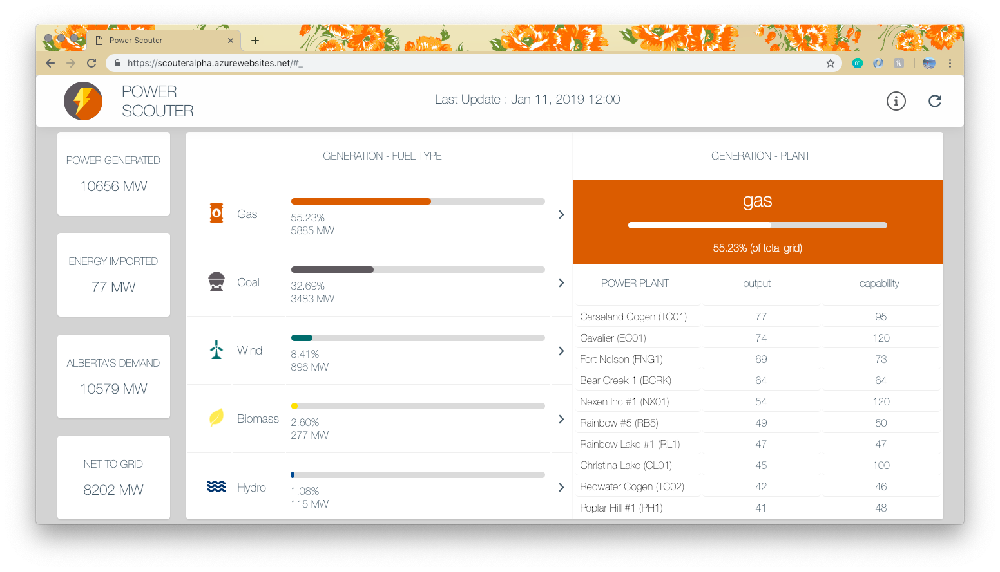
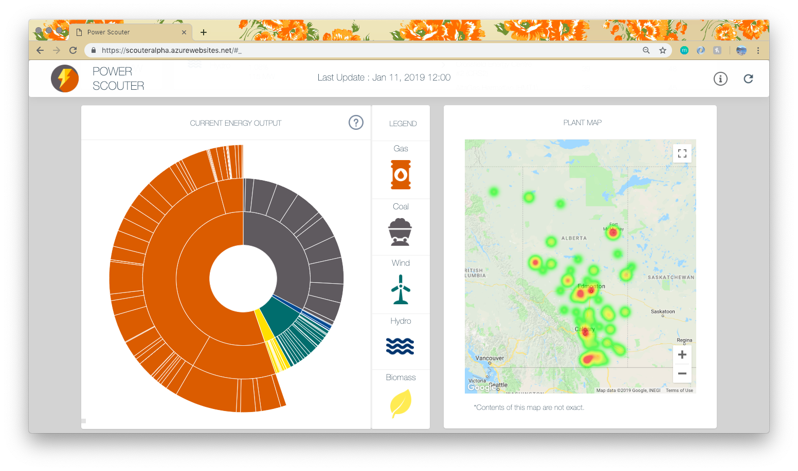
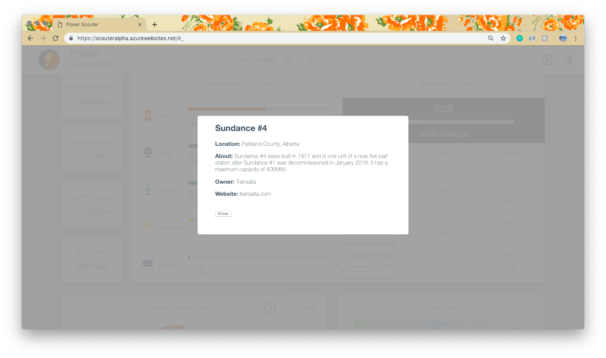

# Power Scouter

Power Scouter is a data graphing app for power generation in Alberta made by Taylor Cameron, Alex Buck, and Katherine Connolly for Lighthouse Labs in Calgary.

Using data from AESO, it maps the current output of all forms of energy and the powerplants that produce them.

This data can be used for informational purposes, but is subject to a margin of error.

## Webpage URL
scouterAlpha.azurewebsites.net

## Tech Stack
- .NetCore
- Html Agility Pack
- NpgSql
- Azure Function Apps
- Redis
- Express
- React
- Google Maps
- D3

## Dependencies

- bluebird
- chai-http
- cheerio
- compression
- cors
- dotenv
- express
- google-map-react
- morgan
- nodemon
- prop-types
- react
- react-dom
- react-geocode
- recompose
- redis
- request
- request-promise
- babel
- d3

## screenshots

